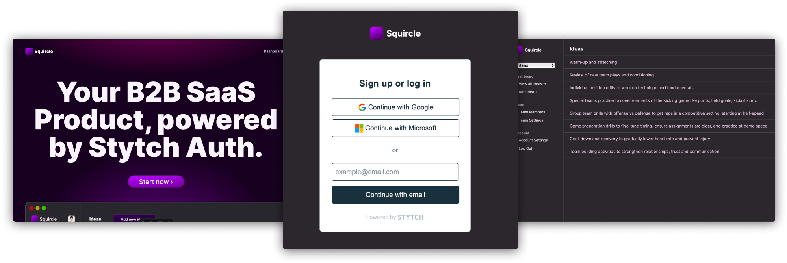
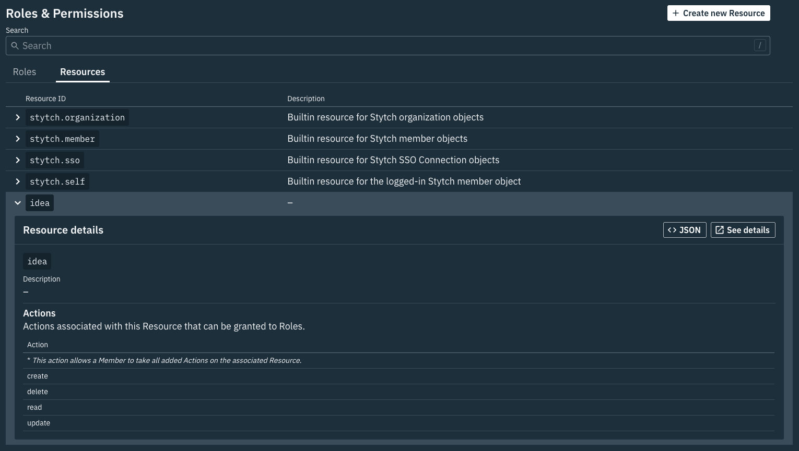
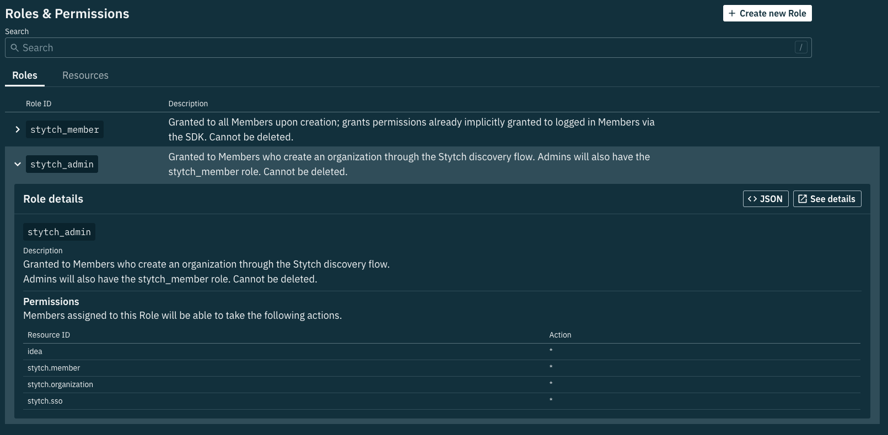
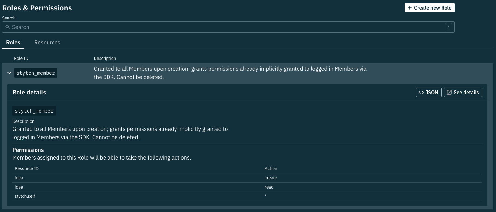

# Stytch B2B App Demo - Pre-built UI

<p align="center">
  
</p>

> 💬 **Note from maintainers**
>
> This application is purely for demonstration and educational purposes. Its setup and configuration resemble typical real-world applications, but it's not a full-fledged production system. Use this app to learn, experiment and tinker with [Stytch][stytch].
>
> Happy Coding!

This demo app is focused on demonstrating the power and flexibility of [Stytch](stytch) in [B2B Authentication](https://stytch.com/b2b) scenarios from a **frontend-focused** approach, leveraging [Stytch Pre-built B2B UI components](https://stytch.com/docs/b2b/guides/ui-components/overview). Custom functionality is achieved using [Stytch Frontend SDKs](https://stytch.com/docs/b2b/guides/implementation/frontend-headless) and direct calls to the [Stytch Backend API](https://stytch.com/docs/b2b/guides/implementation/backend).


## 👀 Looking for an example of [Stytch B2B with a headless/custom UI][stytch-headless-ui]? 👀
### See [stytchauth/stytch-b2b-saas-headless-example][b2b-headless-ui-gh]

## Features

- [Multi-tenancy in Stytch's data model](https://stytch.com/docs/b2b/guides/multi-tenancy)
- [Role-Based Access Control (RBAC)](https://stytch.com/docs/b2b/guides/rbac/overview)
- [Stytch Organization](https://stytch.com/docs/b2b/guides/organizations/org-settings) and member settings management via your own UI
- Supports multiple authentication methods ([Email Magic Link (EML)](https://stytch.com/docs/b2b/guides/magic-links/send-login-or-signup-eml) and [OAuth](https://stytch.com/docs/b2b/guides/oauth/login) implemented)

This demo is specifically designed to be a reference for anyone building their own B2B SaaS application. The auth-specific logic is well documented, and the demo code kept simple and separate for easy review and subsequent deletion.

The source code is thoroughly documented inline, including links to the underlying API calls being used.

## Project Structure

This project has two components: a client built as an single-page app (SPA) [React](https://react.dev) app dashboard embedded in an [Astro](https://astro.build) site (source in `client`) and a server built as a [Node](https://nodejs.org) [Express](https://expressjs.com) API (source in `server`). Both live in this repo, and you can run them both at the same time by opening two terminals.

### Client: React SPA + Astro

For an app dashboard, a React SPA is a straightforward way to deliver the client experience. It makes calls to the server API by sending a session cookie, which allows the API to ensure that the current user is authorized to see the data they've requested.

For non-dashboard pages, such as the homepage, the best user experience is to deliver zero JavaScript. For that reason, the marketing side of the client is delivered by Astro, which will ship static files and zero JavaScript by default.

### Server: Node + Express

To handle business logic that requires secret credentials, Node + Express is one of the most common approaches for JavaScript developers. It’s got a great ecosystem and it's deployable anywhere.

## Local Development

For local development, you'll need:

- A Stytch account: https://stytch.com/
- Node >= 20.6.0

### Clone the project

```bash
# clone the repo
gh repo clone stytchauth/stytch-b2b-saas-pre-built-ui-example

# move into the cloned project
cd stytch-b2b-saas-pre-built-ui-example/

# install dependencies
cd client/
npm i

cd ../server/
npm i
```

### Create or configure a Stytch B2B project

Before you can run the app, you'll need a [Stytch B2B][stytch-b2b] project.

Note: In development, this app assumes the `test` Stytch environment, which can be set in the top navigation in the [Stytch Dashboard][stytch-dashboard].

If you don't have one already, in the [Stytch Dashboard][stytch-dashboard], click on your existing project name in the top left corner of the Dashboard, click **Create a new project**, and then select **B2B Authentication** or select the project you want to use for this app.

#### Configure Redirect URLs

Configure the following [Redirect URLs](https://stytch.com/docs/b2b/guides/dashboard/redirect-urls) for your project in the [Stytch Dashboard Redirect URLs][stytch-dashboard-redirect-urls] page:

- `http://localhost:4321/dashboard/login` Set as **DEFAULT** for **Login, Signup, Invite, Reset Password and Discovery** types.

#### Configure Frontend SDK in the Stytch Dashboard

In the [Frontend SDK Configuration](https://stytch.com/dashboard/sdk-configuration) of the [Stytch Dashboard][stytch-dashboard] make the following updates:

- In the **Authorized applications** section add `http://localhost:4321` as an authorized domain in addition to `http://localhost:3000`.

- In the **Enabled methods** section:

  - **Member actions & permissions** must be **enabled**. To learn more about our RBAC implementation, see our [RBAC guide][stytch-rbac-guide].

  - **Create organizations** must be **enabled**.

#### Create the required resource and actions and assign to Stytch Default Roles

[Stytch's Role-Based Access Control (RBAC)](https://stytch.com/docs/b2b/guides/rbac/getting-started) solution is an authorization model that manages access to resources within your application. Our RBAC model streamlines the management and enforcement of permissions with a flexible interface that's designed for a multi-tenant auth system.

We will be leverage the `stytch_admin` and `stytch_member` created by default for each project [Stytch Resources & Roles Stytch B2B SaaS Authentication](https://stytch.com/docs/b2b/guides/rbac/stytch-defaults) and creating a resource `idea`, with CRUD actions.

In your Stytch dashboard under [Roles & Permissions > Resources](https://stytch.com/dashboard/rbac?env=test&type=Resources), create a resource called `idea`. Give the `idea` resource the following actions:

- `create`
- `delete`
- `read`
- `update`



Navigate to [Roles & Permissions](https://stytch.com/dashboard/rbac?env=test&type=Roles) and

- Update the `stytch_admin` role to allow all actions for the `idea` with `*`



- Update the `stytch_member` role with `create` and `read` actions



This allows `stytch_member`'s to create and read ideas and `stytch_admin` with all CRUD functionality that we can leverage for our application logic, enforced by Stytch.

Read more about the capabilities of the default roles `stytch_admin` and `stytch_member` in [our docs](https://stytch.com/docs/b2b/guides/rbac/stytch-defaults).

#### Get your API credentials and store them in the `.env` files

Your API keys will be in your dashboard at this URL:

https://stytch.com/dashboard/api-keys?env=test

Add the project ID, secret, and public token to `server/.env`:

```bash
APP_URL="http://localhost:4321"
STYTCH_PROJECT_ID=""
STYTCH_PUBLIC_TOKEN=""
STYTCH_SECRET=""
```

Next, add the same public token to `client/.env`:

```bash
PUBLIC_API_URL="http://localhost:3000"
PUBLIC_STYTCH_TOKEN=""
```

#### Set Up OAuth (Optional)

To allow sign in with Google and/or Microsoft OAuth, follow the steps in your [Stytch Dashboard][stytch-dashboard] to [configure the OAuth apps](https://stytch.com/dashboard/oauth) Refer to [Log in with OAuth](https://stytch.com/docs/b2b/guides/oauth/login) in the [Stytch B2B SaaS Authentication](https://stytch.com/docs/b2b/guides/oauth/login) guides more information.

## Start the client and server

In one terminal, start the server:

```bash
# make sure you're in the server directory
cd server/

# start the app
npm run dev
```

This will start the server at `localhost:3000`.

In a second terminal, start the client:

```bash
# make sure you're in the client directory
cd client/

# start the dev server
npm run dev
```

This will start the client at `localhost:4321`.

From here, you should be able to open the site in your browser, and clicking on the "Dashboard" or "Start now" links will take you to the login page, which will let you register for your app and create an organization.

> **NOTE:** In test mode, you can only use emails matching the domain you signed up with. Trying to use other emails will result in Stytch errors.

[stytch]: https://stytch.com
[stytch-dashboard]: https://stytch.com/dashboard/
[stytch-dashboard-redirect-urls]: https://stytch.com/dashboard/redirect-urls
[stytch-b2b]: https://stytch.com/b2b
[stytch-rbac-guide]: https://stytch.com/docs/b2b/guides/rbac/overview

[stytch-headless-ui]: https://stytch.com/docs/b2b/guides/implementation/frontend-headless
[b2b-headless-ui-gh]: https://github.com/stytchauth/stytch-b2b-saas-headless-example